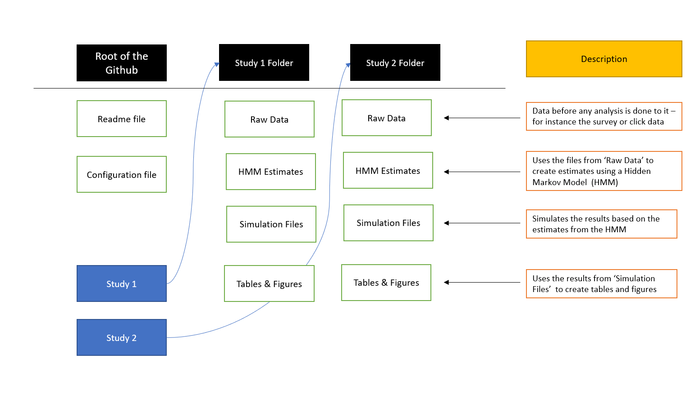

# Replication_Morphing_HMM

This repository contains the replication code for the paper 'Morphing for Consumers Dynamics: Bandits meet HMM' by Gui Liberali and Alina Ferecatu from the Rotterdam School of Management. 

The repository is structured as follows:
- 'Configuration.R' defines global variables necessary for other files, and loads + installs the necessary packages.
- 'Data Dictionary.txt' contains a description of the most important terms used throughout the code
- 'Functions.R' contains several helper functions needed for subsequent analysis performed in the repository. 

Anyone aiming to replicate the results from the paper should first run 'Configuration.R' and read 'Data Dictionary.txt'. In the paper, two studies are performed - each has a separate folder, which is structured as follows. 

